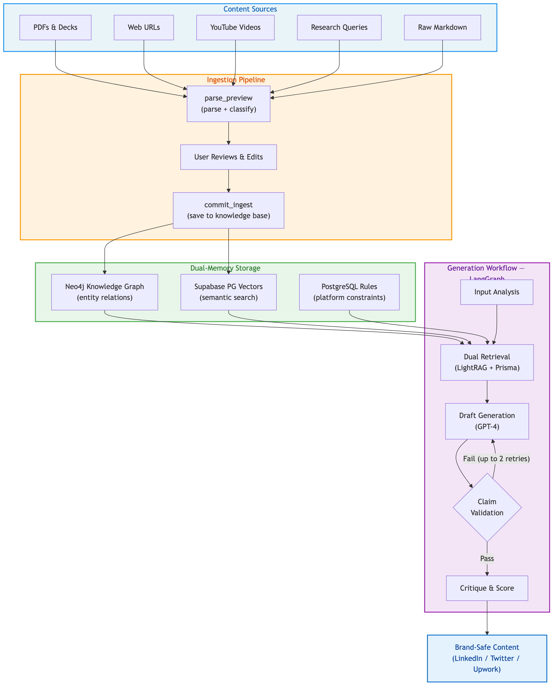
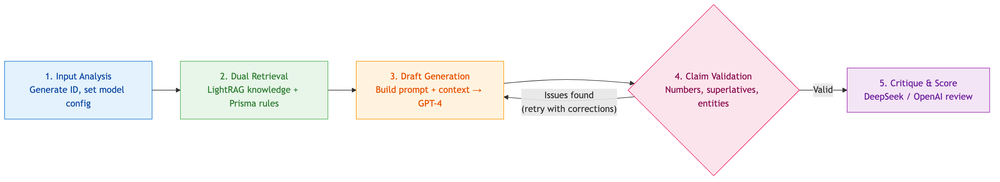

# Founder Context Engine

A brand intelligence engine that ingests curated business knowledge and generates high-authority, brand-safe marketing content across LinkedIn, Twitter, and Upwork.

It works like a controlled reasoning system rather than a chatbot — everything goes through human review, claim validation, and source-grounded generation.

## How It Works



## Quick Start

```bash
# clone and install
git clone https://github.com/faisal-saddique/founder-context-engine.git
cd founder-context-engine
uv sync

# set up environment
cp .env.template .env
# fill in your API keys (see Environment Variables below)

# initialize databases
uv run scripts/setup_db.py
uv run scripts/seed_data.py

# run the server
uv run uvicorn src.api.main:app --reload --host 0.0.0.0 --port 8000

# verify it's working
curl http://localhost:8000/health
```

## Environment Variables

Create a `.env` file from `.env.template`. Here's what you need:

| Variable | Required | Description |
|----------|----------|-------------|
| `OPENAI_API_KEY` | Yes | Powers content generation (GPT-4) and classification (GPT-4o-mini) |
| `DATABASE_URL` | Yes | Supabase pooled connection (Prisma ORM) |
| `DIRECT_URL` | Yes | Supabase direct connection (LightRAG vector storage) |
| `NEO4J_URI` | Yes | Neo4j AuraDB connection URI |
| `NEO4J_USERNAME` | Yes | Neo4j username (usually `neo4j`) |
| `NEO4J_PASSWORD` | Yes | Neo4j password |
| `TAVILY_API_KEY` | Yes | Tavily research API for the research parser |
| `LLAMA_CLOUD_API_KEY` | Yes | LlamaParse for PDF/document parsing |
| `FIRECRAWL_API_KEY` | Yes | Firecrawl for web URL scraping |
| `DEEPSEEK_API_KEY` | No | DeepSeek for content critique (falls back to OpenAI) |
| `LANGSMITH_API_KEY` | No | LangSmith for workflow tracing/observability |
| `LANGCHAIN_TRACING_V2` | No | Set to `true` to enable LangSmith tracing |
| `ENVIRONMENT` | No | `development` or `production` (default: `development`) |

## API Endpoints

Once the server is running, visit **http://localhost:8000/docs** for the interactive Swagger UI where you can test all endpoints directly.

### Health

```
GET /         → API info
GET /health   → Service health + dependency status
```

### Ingestion (Preview → Edit → Save)

Content goes through a two-step process so you can review before committing:

**Step 1: Preview**
```
POST /api/v1/ingest/parse_preview
```
Parses content and classifies it into one of 5 schemas. Returns markdown for review. Nothing is saved yet.

```json
{
  "source_type": "markdown",
  "content": "# Our App Growth Story\n...",
  "metadata": { "author": "Team", "tags": ["case-study"] }
}
```

**Step 2: Commit**
```
POST /api/v1/ingest/commit_ingest
```
After reviewing (and optionally editing) the preview, commit to the knowledge base.

```json
{
  "markdown_content": "# Our App Growth Story\n...",
  "source_type": "markdown",
  "content_schema": "case_study",
  "metadata": { "author": "Team", "file_name": "growth.md" },
  "usage_permission": "public_safe",
  "trust_score": "High"
}
```

### Generation

```
POST /api/v1/generate/
```
Generates brand-safe content using a 5-node LangGraph workflow.

```json
{
  "platform": "linkedin",
  "post_format": "deep_dive",
  "specific_resource_context": "Share insights about ASO strategies for indie founders",
  "tone": "professional",
  "custom_instructions": "Keep it under 300 words"
}
```

The response includes the generated content, validation results, retry count, and a critique score.

### Validation

```
POST /api/v1/generate/validate
```
Standalone claim validation — check any content against source material.

```json
{
  "content": "We have 500 clients and are the best agency.",
  "sources": [
    { "content": "We have helped 50 founders.", "trust_score": "High" }
  ]
}
```

Returns `is_valid: false` with specific issues like `unverified_number` or `unverified_superlative`.

## Content Schemas

All ingested content gets classified into one of 5 master schemas:

| Schema | What belongs here | Examples |
|--------|-------------------|----------|
| `case_study` | App stories, client projects, results | "Cleaner app grew from 0 to 150K downloads" |
| `profile` | Customer profiles, personas, ICPs | "Indie iOS developers with 1-5 apps" |
| `guide` | Playbooks, SOPs, best practices | "ASO keyword optimization steps" |
| `market_intel` | Industry news, trends, platform changes | "Apple Search Ads pricing update 2026" |
| `general` | Everything else, or confidence < 60% | Ambiguous content |

The classifier (GPT-4o-mini) assigns a schema with a confidence score. If confidence is below 60%, it falls back to `general`. You can always override the schema manually before committing.

## Source Types

The engine can ingest content from multiple source types:

| Source Type | Parser | What it handles |
|-------------|--------|-----------------|
| `markdown` | MarkdownParser | Direct text/markdown input |
| `pdf_deck` | DocumentParser | PDFs and PPTX via LlamaParse |
| `web_url` | WebParser | Web pages via Firecrawl |
| `app_store_link` | WebParser | App Store URLs |
| `youtube_summary` | VideoParser | YouTube transcript extraction |
| `research` | ResearchParser | Tavily web research queries |

## Validation & Retry Loop

When the LLM generates content, claims get checked automatically:

1. **Detect** — Scans for numbers (`"150K downloads"`), superlatives (`"the best"`, `"fastest"`), and company names (`"Acme Corp"`)
2. **Validate** — Checks each claim against retrieved knowledge via substring matching
3. **Retry** — If validation fails, the draft is sent back to the LLM with specific correction instructions (e.g., "Remove unverified number: 500 users"). Up to 2 retries.
4. **Best attempt** — If all retries fail, the attempt with the fewest issues is used

The retry count and any remaining issues are included in the API response metadata.

## Generation Workflow

The `/generate` endpoint runs a 5-node LangGraph workflow. Nodes 3 and 4 can loop — if validation catches hallucinated claims, the workflow routes back to Node 3 with correction instructions.



## Project Structure

```
admin/
├── start.py                     # Admin server launcher (reads .env, wires LightRAG Server)
├── start.sh                     # Convenience bash wrapper for start.py
└── rag_storage/                 # Local working dir for LightRAG Server (gitignored)
src/
├── api/
│   ├── main.py                  # FastAPI app, lifespan, CORS
│   └── routes/
│       ├── health.py            # GET /health
│       ├── ingestion.py         # parse_preview, commit_ingest
│       └── generation.py        # generate, validate
├── core/
│   ├── config.py                # Settings from environment
│   ├── logging.py               # Structured logging
│   └── exceptions.py            # ParsingError, IngestionError, etc.
├── db/
│   └── neo4j_client.py          # Async Neo4j connection
├── models/
│   ├── schemas.py               # All Pydantic request/response models
│   └── knowledge.py             # UnifiedKnowledge for LightRAG
└── services/
    ├── ingestion/               # Parsers + classifier
    ├── retrieval/               # LightRAG + Prisma rule fetcher
    ├── graph/                   # LangGraph workflow (state, nodes, routing)
    ├── validation/              # Claim detection + source checking
    └── llm/                     # OpenAI wrapper for generation + critique
```

## Admin Panel (Knowledge Base Inspector)

A local admin server built on [LightRAG Server](https://github.com/HKUDS/LightRAG/blob/main/lightrag/api/README.md) that connects to the same Neo4j and Supabase instance as the production app. Useful for visually auditing the knowledge graph, checking ingested documents, and testing queries — without writing any code.

```bash
./admin/start.sh
# or
uv run python admin/start.py
```

Opens at **http://127.0.0.1:9621** (localhost only, not exposed to the network).

| Tab | What you get |
|-----|-------------|
| **Documents** | Every ingested document with its ID, chunk count, and status |
| **Knowledge Graph** | Interactive graph — click any entity to see its properties and relationships |
| **Retrieval** | Chat-style query sandbox with mode selector (local / global / hybrid) |

The admin server is read-only from a data-integrity standpoint — it shares no state with the running production API. Credentials are read from the project `.env` automatically.

## Scripts

```bash
uv run scripts/setup_db.py           # Initialize databases and verify connections
uv run scripts/seed_data.py          # Populate with sample rules and platform configs
uv run scripts/ingest_dataset.py     # Bulk ingest files from Dataset/ directory
uv run scripts/ingest_podcasts.py    # Ingest podcast transcripts via API
uv run scripts/cleanup_postgres.py   # Clear PostgreSQL tables
uv run scripts/cleanup_neo4j.py      # Clear Neo4j graph
```

## Testing

```bash
# run everything
uv run pytest

# verbose with short tracebacks
uv run pytest -v --tb=short

# just unit tests
uv run pytest tests/unit/

# just integration tests (needs live DB connections)
uv run pytest tests/integration/

# specific test file
uv run pytest tests/unit/test_validation_retry.py -v
```

The test suite covers:
- All Pydantic models and enums
- Each parser (with mocked external services)
- Claim detection and validation logic
- The validation retry loop and routing
- API endpoints (using FastAPI TestClient with mocked services)
- Design strategy compliance (5 schemas, 60% threshold, preview-then-commit)
- Dataset ingestion pipelines with real content

## Tech Stack

| Component | Technology | Purpose |
|-----------|-----------|---------|
| API | FastAPI | REST endpoints |
| Workflow | LangGraph | Stateful generation pipeline with conditional routing |
| Semantic Memory | LightRAG | Knowledge retrieval (Neo4j graph + PG vectors) |
| Graph DB | Neo4j AuraDB | Entity relationships from ingested content |
| Vector DB | Supabase PostgreSQL | Semantic search via pgvector |
| Rules DB | PostgreSQL + Prisma | Platform-specific rules and constraints |
| Generation | OpenAI GPT-4 | Content drafting |
| Classification | OpenAI GPT-4o-mini | Schema detection with structured output |
| Document Parsing | LlamaParse | PDF and PPTX extraction |
| Web Scraping | Firecrawl | URL content extraction |
| Research | Tavily | Web research queries |
| Video | youtube-transcript-api | YouTube transcript extraction |
| Observability | LangSmith | Workflow tracing (optional) |
